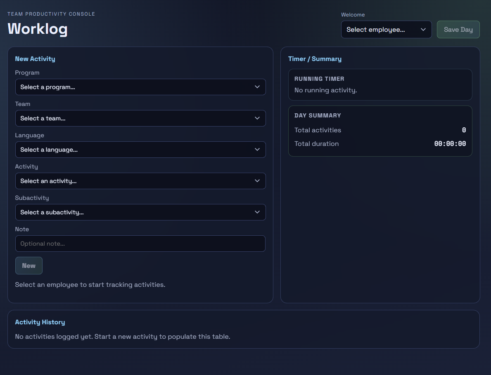
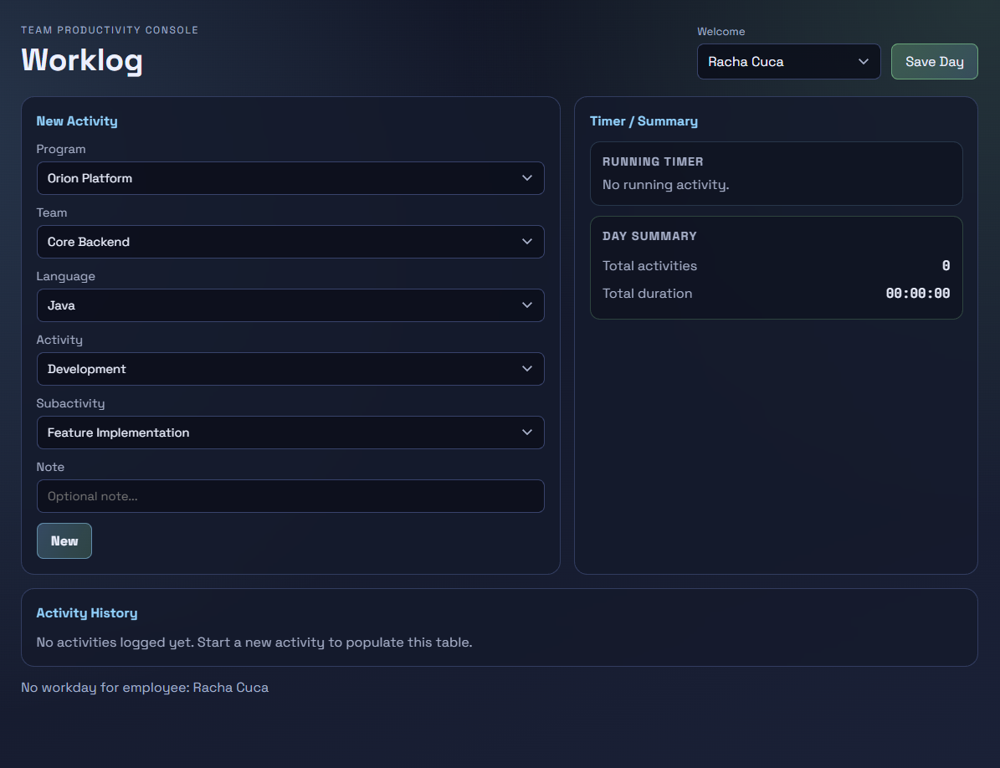
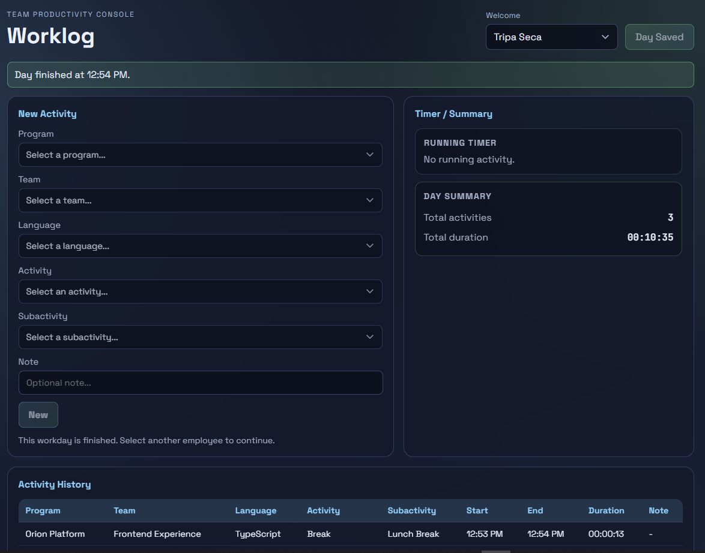

<h1 align="center">Worklog</h1>

<p align="center">
  <strong>Languages:</strong><br>
  <a href="README.pt.md">Portuguese</a> |
  <a href="README.md">English</a>
</p>

Worklog is a **full-stack** application for daily activity tracking in software teams. It allows employees to register tasks by **Program, Team, Language, Activity, and Subactivity**, with automatic time tracking per activity.

The system supports:

- Starting a new activity and automatically closing the previous running one
- Finishing the day with a single action (`Save Day`)
- Daily history with durations and current running task highlight
- Centralized API error handling and frontend notifications

## Project Motivation

This project was built from a real operational need: improve daily work registration with a simple but consistent workflow for developers.

The goal was to keep the **UX clear** while maintaining strong backend business rules for:

- one open activity at a time
- one workday per employee per date
- explicit day finalization

## Current Features

### Backend (Spring Boot + PostgreSQL)

- REST API for worklog flow:
  - `POST /api/worklog/{employeeId}/start`
  - `POST /api/worklog/{employeeId}/save`
  - `GET /api/worklog/{employeeId}?date=YYYY-MM-DD`
- Lookups API:
  - `GET /api/lookups`
  - `GET /api/lookups/subactivities?activityId=...`
- Employees API:
  - `GET /api/employees`
- Business rules:
  - closes previous running activity when a new one starts
  - prevents starting activities after day is finished
  - validates Activity x Subactivity relationship
- Seed data (`data.sql`) for programs, teams, languages, activities, subactivities, employees
- Global exception handler with standardized error response
- CORS config for Angular dev environment

### Frontend (Angular)

- Worklog page with:
  - employee selector
  - activity form
  - running timer and summary
  - activity history table
- Form behavior:
  - dependent subactivity list by selected activity
  - clear form after `New`
  - lock form when day is finished
- UX:
  - global top loading bar
  - toast notifications for API feedback
  - day-finished banner and clear disabled states
  - responsive layout with horizontal scroll for history table on small screens

## Worklog Flow

1. Select employee
2. Choose Program, Team, Language, Activity, Subactivity
3. Click `New` to start tracking
4. Start another activity to automatically close the previous one
5. Click `Save Day` to close running activity and finish the day

## Technologies

### Backend

- Java 21
- Spring Boot
- Spring Data JPA
- PostgreSQL
- Maven

### Frontend

- Angular (standalone components)
- TypeScript
- SCSS
- RxJS

## How to Run Locally

1. Clone:

```bash
git clone https://github.com/pitercoding/worklog.git
cd worklog
```

2. Configure database credentials in environment variables:

```bash
DB_USER=your_user
DB_PASSWORD=your_password
```

3. Run backend:

```bash
cd backend
./mvnw spring-boot:run
```

4. Run frontend:

```bash
cd frontend
npm install
ng serve
```

5. Open:

- Frontend: `http://localhost:4200`
- Backend: `http://localhost:8080`

## API Notes

- The frontend uses employee selection (no authentication flow yet).
- Workday is date-based; once finished, it can only start again on the next date.

## Testing Status

Current status:

- core frontend/backend integration tested manually
- production-grade unit/integration test coverage still pending

Recommended next test scope:

- backend service tests for start/save day rules
- controller tests for response/validation behavior
- frontend store and component tests for state transitions

## Next Improvements

### Authentication and Security

- Add login with JWT
- Replace employee dropdown with authenticated user context
- Add role-based access for admin/user operations

### Product and UX

- Add date picker to view previous workdays
- Add edit/correct flow for mistaken entries
- Add dashboard and reports (time by activity, team, language)

### Engineering and Quality

- Add unit and integration tests (backend + frontend)
- Introduce Flyway/Liquibase migrations for schema versioning
- Add CI pipeline (lint, test, build)

### Deployment

- No deployment yet
- Future setup suggestion:
  - Backend: Render or Railway
  - Frontend: Vercel or Netlify
  - Database: managed PostgreSQL (Neon/Supabase/Aiven)

## Folder Structure

```text
worklog/
├─ backend/                              # Spring Boot API
│  ├─ src/main/java/com/pitercoding/backend/
│  │  ├─ config/                         # CORS and app-level config
│  │  ├─ controller/                     # REST endpoints (worklog, lookups, employees)
│  │  ├─ dto/                            # Request/response payloads
│  │  ├─ exception/                      # Global exception handling
│  │  ├─ mapper/                         # Entity -> DTO mapping
│  │  ├─ model/                          # JPA entities and enums
│  │  ├─ repository/                     # Spring Data repositories
│  │  ├─ service/                        # Business rules and application logic
│  │  └─ BackendApplication.java         # Spring Boot entrypoint
│  ├─ src/main/resources/
│  │  ├─ application.properties          # Base configuration
│  │  ├─ application-dev.properties      # Dev profile configuration
│  │  └─ data.sql                        # Seed data (lookups, employees)
│  └─ pom.xml                            # Maven dependencies and build
├─ frontend/                             # Angular client app
│  ├─ src/app/
│  │  ├─ core/                           # Constants, interceptors, global UI services
│  │  ├─ features/worklog/               # Worklog domain (pages, components, state, services)
│  │  ├─ shared/                         # Reusable pipes and utils
│  │  ├─ app.config.ts                   # Global providers setup
│  │  └─ app.routes.ts                   # Routing configuration
│  ├─ src/assets/
│  │  ├─ images/                         # Logos and static image assets
│  │  └─ screenshots/                    # Project screenshots and capture plan
│  ├─ src/main.ts                        # Angular bootstrap
│  └─ package.json                       # Frontend scripts and dependencies
├─ README.md                             # Documentation (English)
└─ README.pt.md                          # Documentation (Portuguese)
```

## Screenshots & Visuals

### Worklog Home (No Employee Selected)



### Activity Form Filled



### Running Activity & Activity History


### Day Finished



## License

This project is licensed under the **MIT License** — feel free to use, study, and modify it.

## Author

**Piter Gomes** — Computer Science Student (6th Semester) & Full-Stack Developer

[Email](mailto:piterg.bio@gmail.com) | [LinkedIn](https://www.linkedin.com/in/piter-gomes-4a39281a1/) | [GitHub](https://github.com/pitercoding) | [Portfolio](https://portfolio-pitergomes.vercel.app/)
